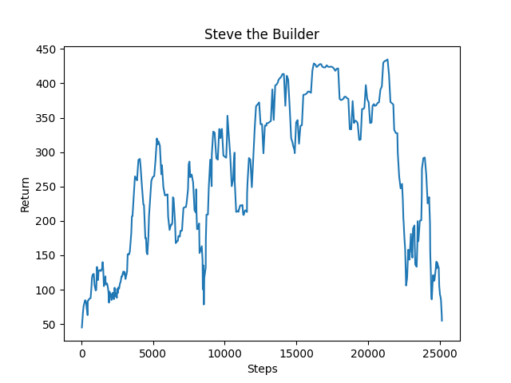
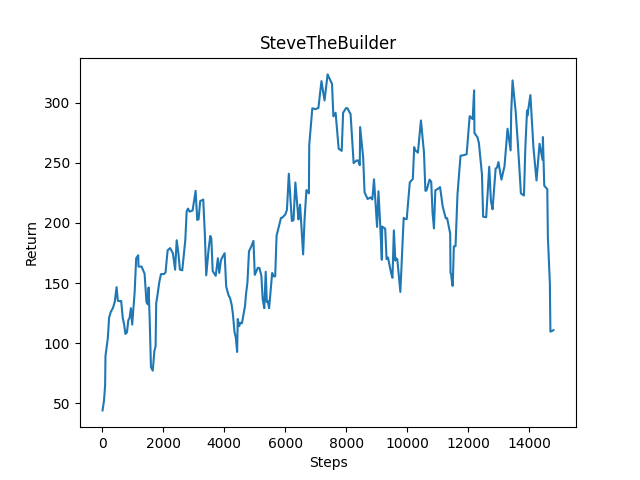
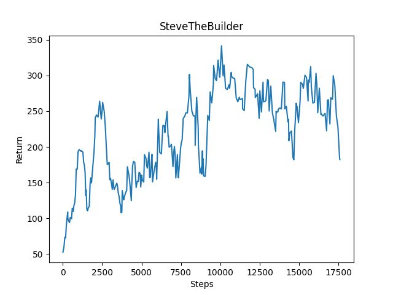
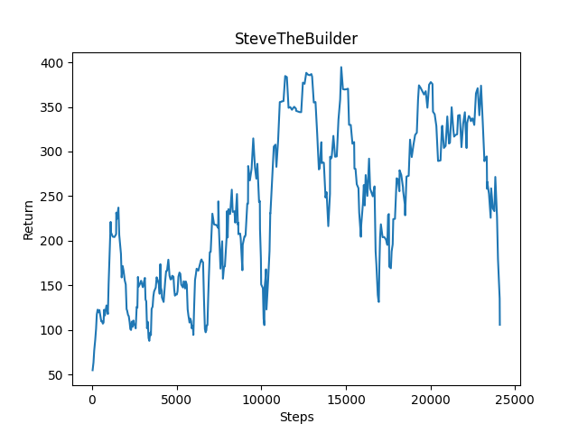
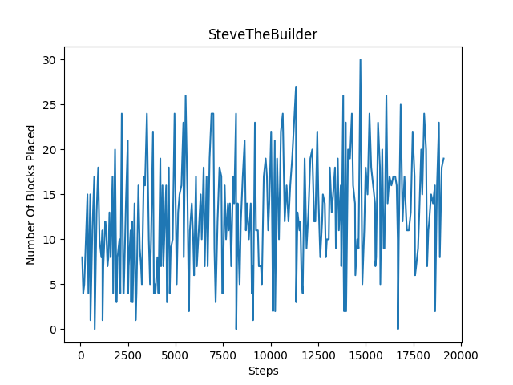
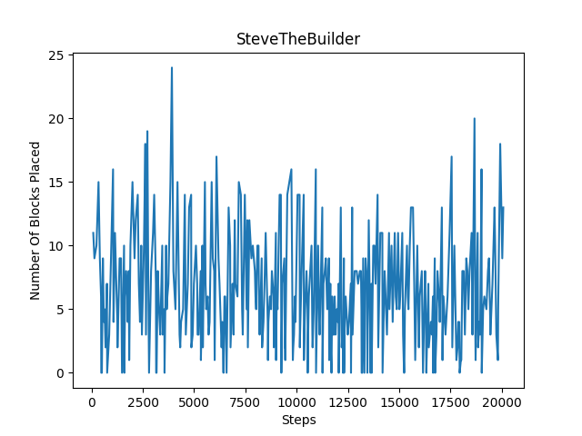
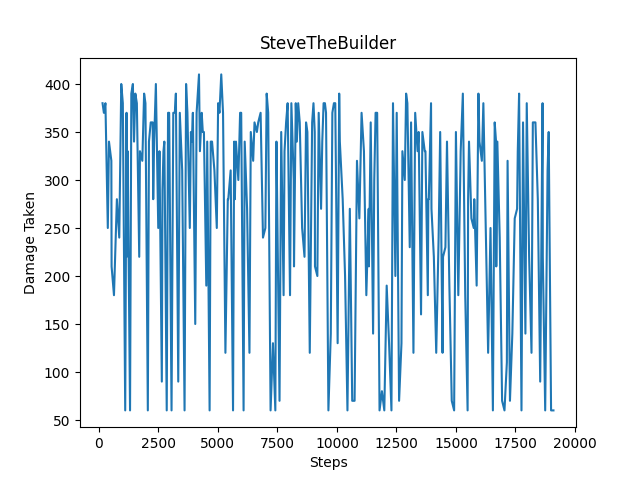
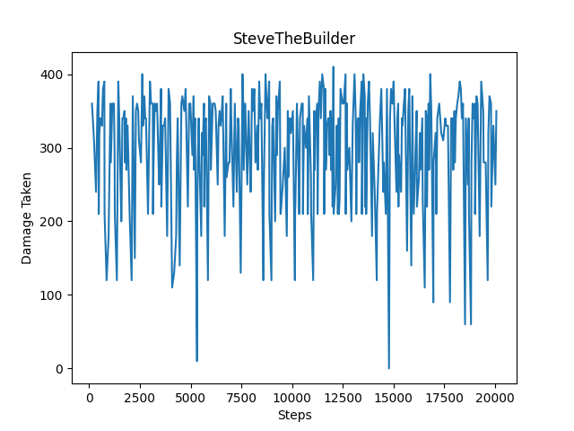
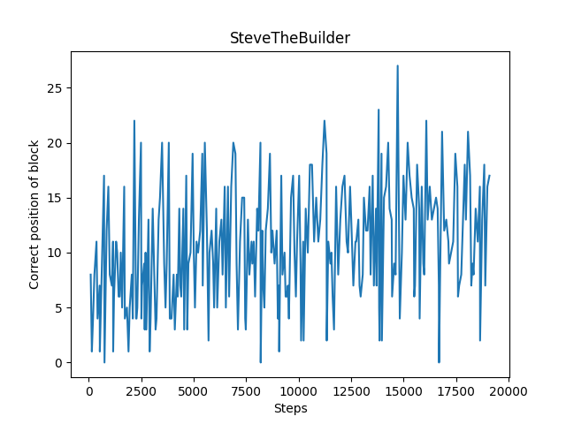
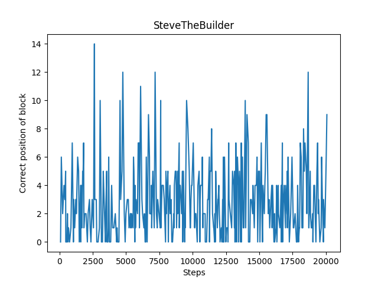

## Project Video

<iframe width="800" height="540" src="https://www.youtube.com/embed/bSsGXXZwM88" title="YouTube video player" frameborder="0" allow="accelerometer; autoplay; clipboard-write; encrypted-media; gyroscope; picture-in-picture" allowfullscreen></iframe>

## Project Summary

Our goal is to have our agent, Steve[1](#footnote), protect himself for as long as possible against a Ghast/multiple Ghasts by building a shelter-like block structure. A Ghast is a floating ghost-like hostile mob that shoots explosive fireballs at the player every three seconds. The Ghast is an ideal enemy for this project because it can shoot from multiple directions and angles. This sort of behavior from the Ghast, juxtaposed with the use of reinforcement learning, will allow Steve to learn how to build a more robust structure. Because minecraft is not flat, and can have hilly terrain, we also tested Steve's building potential in varying environments.

Our project uses a type of reinforcement learning called the Deep Q learning algorithm. The algorithm attempts to find the optimal action for each possible state in the situation provided. Using ObservationFromGrid and ObservationFromNearbyEntities, we can set up positive/negative rewards including whether the agent is facing the Ghast, how long Steve has survived, how much damage Steve has taken, and/or whether a block has been placed in order to determine the optimal action. The greatest challenge of this project is selecting what to reward, and how to weigh them to optimize our goal.

The project relates to Minecraft as there are many different kinds of enemies that the player needs to face, and being able to build structures to protect against the mobs is an important skill.

## Approaches

The prototype problem we used had a Ghast; a hostile, unmoving, ranged fireball-throwing creature; spawn near the agent. The agent's goal was to build a shelter to defend itself from the Ghast. Our baseline approach involved giving the agent a positive reward for each tick (there are 20 ticks a second in Minecraft) it survived and a negative reward when it took damage, proportional to how much damage it took. The agent could observe blocks around it in a 2 x 5 x 5 grid, where the 2 is the y-coordinate (the same plane as the agent's height). The action space included turning left or right, looking up or down, and placing blocks. Movements were "discrete", as in the agent could only decide to turn 90 degrees or look up or down 45 degrees at a time. The agent used the deep Q learning algorithm provided by the RLlib library. This algorithm was used since the environment is relatively static (only the agent is moving) and there are a low number of states, since it just considers what blocks are near the agent. This baseline performed pretty well, achieving pretty high scores consistently by the 14k steps mark.

The baseline approach worked well enough for our initial prototype problem, so we looked for greater challenges. First off, we changed movement commands to be continuous, meaning that the agent could decide how much to turn left or right, instead of only being able to turn 90 degrees in either direction. To accomodate this, since deep Q learning does not allow for continuous actions, we used the proximal policy optimization algorithm that came with assignment2. We felt that there were enough challenges to solve in determining useful reward and observation metrics, so our efforts focused more on that.

Since the agent seemed to be metagaming when the Ghast spawned only in one direction by constructing an L-shaped wall in the direction of the Ghast at the start of the challenge, we started spawning the Ghast randomly around in the agent in four possible starting spots (north, south, east, and west of the agent). The agent struggled more to learn in this environment. Part of the challenge is possibly inconsistent results based on observation, since the agent only sees blocks around itself and not the Ghast.

One approach was giving the agent a reward for placing blocks, with the expectation that the agent would eventually learn to build walls in all four directions to protect itself from a Ghast in any direction. Adding a reward of 1 for placing blocks seemed to result in some learning, although there was still significant variance in the results.

Another approach that was tried for this problem was providing the agent its yaw (how much left or right it is turned) amount directly, instead of turning the observation of blocks to match where the agent was looking. We expected this approach to make the agent more adaptive since it now had continuous movements, and the turning observation of blocks mechanism seemed to be made for discrete movements since it only updated every 90 degrees the agent turned. This change appeared to have resulted in a similar rate of learning as the agent with the simplifier, and had a similar behavior of building an L shape structure at the start of the challenge.

While our initial goal was provoking the agent to build a structure around itself entirely, we realized that this was pretty difficult to reward. This is also not as interesting of a solution since it is pretty static, and in the game, it limits one's options. Therefore, we focused more on having the agent be adaptive to the Ghast, building defenses only where necessary.

Our next approach then was to give the agent a positive reward when it was looking in the direction of the Ghast (with an error range of 70 degrees from the yaw the agent would have if it were looking directly at the Ghast). Blocks placed while not looking in the direction of the Ghast usually did not help much. This reward could also be scaled to an agent that is receiving video input instead of using Malmo's "cheating" observation system.

We combined these various approaches, after testing them on the prototype problem of our status report to ensure they worked the same or better than our baseline approach, to attempt teaching the agent to fend off a flying Ghast in a hill environment. Despite different variations of these approaches we were generally unable to get an agent to solve the problem. The spawn positions are pretty inconsistent, which seems to confuse the agent as it associates actions and states that are not great (no shelter and looking at the sky) to high rewards, if it is the case that the Ghast spawned on the other side of the hill and cannot find the player. Additionally, sometimes the Ghast would shoot the agent from above, so even though the agent had built a decent shelter (left, right, forward and back of the agent), the agent would still die since it had not built a roof.

## Evaluation

For our project, we kept track of three main factors for our evaluation: blocks placed, damage taken, and blocks placed while looking at Ghast. We wanted to evaluate how each factor contributed to our best case scenario.

At the end of each episode, we recorded each factor separately, by appending the block_count, damage_taken, facing_ghast_count, and correct_position_count to an array we would use to display the graphs below. For each evaluation, the top image is on flat terrain and the bottom image is on hilly terrain. All images are using continuous commands.

The number of blocks placed every 300 steps is showcased below. For flat terrain, we can see there is a gradual increase in the number of blocks placed. However, for hilly terrain, our agent mostly struggled to place blocks even after reaching 20000 episodes. We think this is because it is difficult for the agent to place blocks on hilly terrain, as it has to pitch its head at more extreme angles to build blocks below it.
 

The amount of damage taken every 300 steps is showcased below. For flat terain, there are far more instances where the agent takes less damage compared to hilly terrain. Although our agent takes the maximum damage/dies during an episode quite often, both graphs show a decrease in the amount of damage taken over time, with the agent taking less damage more consistently after reaching 20000 episodes.
 

The amount of blocks placed while facing the ghast every 300 steps is showcased below. For flat terrain, there is a clear gradual increase in the number of blocks placed while facing the ghast. Although, the same situation arises on hilly terrain for blocks placed in general and blocks placed while facing the ghast: our agent struggles to set the blocks, and as a result there isn't much improvement in this area.
 

## References

assignment2 was used as the base or starting point for this project.

For examples on how the documentation is converted to code: [https://github.com/Microsoft/malmo/tree/master/Malmo/samples/Python_examples](https://github.com/Microsoft/malmo/tree/master/Malmo/samples/Python_examples)

Learning what commands can be inputted to Malmo: [https://microsoft.github.io/malmo/0.30.0/Schemas/MissionHandlers.html#type_DiscreteMovementCommand](https://microsoft.github.io/malmo/0.30.0/Schemas/MissionHandlers.html#type_DiscreteMovementCommand)

Malmo documentation: [https://microsoft.github.io/malmo/0.30.0/Schemas/Mission.html](https://microsoft.github.io/malmo/0.30.0/Schemas/Mission.html)

A map of specific features to the official Python examples that contain them: [https://canvas.eee.uci.edu/courses/34142/pages/python-examples-malmo-functionality](https://canvas.eee.uci.edu/courses/34142/pages/python-examples-malmo-functionality)

Finding and quickly comparing different off-the-shelf algorithms [https://docs.ray.io/en/latest/rllib-algorithms.html](https://docs.ray.io/en/latest/rllib-algorithms.html)

HTML to Markdown sheet: [https://github.com/mundimark/quickrefs/blob/master/HTML.md](https://github.com/mundimark/quickrefs/blob/master/HTML.md)

## Footnotes

1. Steve is the main male character of Minecraft. In some runs, a woman character named Alexa replaces him. For simplicity, we will still refer to Alexa as Steve or the agent.

