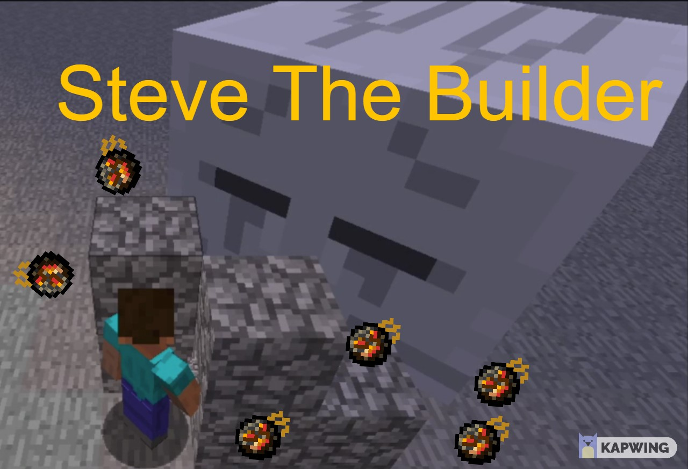

  

## Aloha to Steve The Builder Platform!
Steve the Builder is a project focused on exploring the ways machine learning can be used to control Steve whose main defense against hostile creatures is simply building blocks. The goal is to have Steve create a shelter for itself against different types of enemies and on different kinds of terrains. We use the Malmo Minecraft environment to interface with the game, along with the RLlib library for machine learning algorithms.

## Source Code
Find the source code here: [Steve The Builder On GitHub !](https://github.com/Timmichi/Steve-The-Builder)

## Team Members

Nikola Pratte

Raymond Anggono

Timothy Simanhadi

## Reports

- [Proposal](proposal.html)
- [Status](status.html)
- [Final](final.html)

[quickref]: https://github.com/mundimark/quickrefs/blob/master/HTML.md
