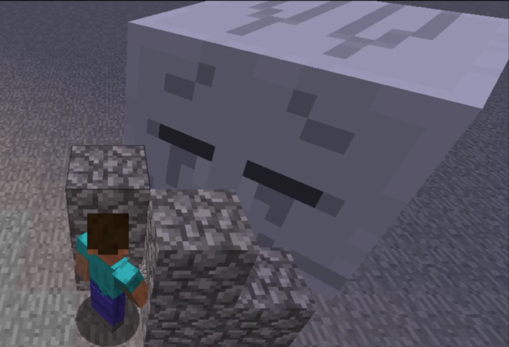

Steve the Builder is a project focused on exploring the ways machine learning can be used to control a bot in Minecraft whose main defense against opposing creatures is simply building. The goal is to have the bot create a shelter for itself against different types of enemies and in different kinds of terrains. We use the Malmo Minecraft environment to interface with the game, along with the RLlib library for machine learning algorithms.

Find the source code here: https://github.com/Timmichi/Steve-The-Builder

Team:
Nikola Pratte
Raymond Anggono
Timothy Simanhadi

Reports:

- [Proposal](proposal.html)
- [Status](status.html)
- [Final](final.html)

[quickref]: https://github.com/mundimark/quickrefs/blob/master/HTML.md
