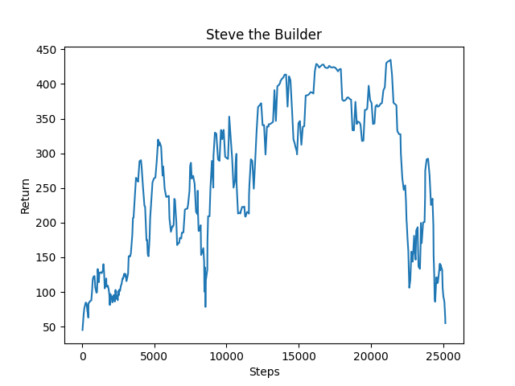

## Project Summary
Steve the Builder is a project focused on exploring the ways machine learning can be used to control a bot in Minecraft whose main defense against opposing creatures is simply building. The goal is to have the bot create a shelter for itself against different types of enemies and in different kinds of terrains.

## Approach
We use the machine learning environment Malmo to input actions to Minecraft as well as get observations. Malmo also provides an interface for rewards, which is useful for one of our rewards. We use the open-source library RLlib's implementation of deep Q-learning (DQN) as our main algorithm. Q-learning is a form of reinforcement learning where the algorithm attempts to find the optimal action for each possible state in the situation provided. Deep Q-learning uses a neural network to map states to actions instead of a table. This algorithm was chosen due to Q-learning's property of having a sort of foresight, where actions are chosen based not only on the predicted future state's value but of states farther in the future as well. We thought that foresight would be useful in this building situation, because the agent has some time to build before they start to get punished (attacked, take damage) by enemies for not building.

The challenge involves having the agent, as the player character (Steve), spawn next to a Ghast, a fireball spitting creature. The Ghast will try to kill the player by shooting fireballs at the character. Our goal is to provide an algorithm so that Steve learns to build some sort of shelter against the incoming fireballs.

Our current implementation uses a limited, discrete action space and observation space, along with two reward systems. The agent is allowed to turn 90 degrees left or right, 45 degrees up or down, and can place blocks. The agent's observation space is a 2 x 5 x 5 grid, where the 2 is the y-coordinate (the same plane as the agent's height), and therefore it fully contains the agent and the area around it. The grid only contains 0s or 1s, where 1s are places where Cobblestone (the agent's placable block) have been placed. As for rewards, the agent has a positive reward per time tick, as determined by the Malmo environment. The agent also has a negative reward for damage taken. This negative reward seemed to be particularly helpful in reinforcing survival behavior from the agent.

## Evaluation
Our main way of evaluating the agent is seeing how long it survives against the Ghast. This can be measured quantitatively, although, it can also be seen qualitatively if we see the Ghast can no longer see the agent or its fireballs no longer reach the agent (Ghasts cannot move). We think this makes sense because the main point of the shelter is for the agent to survive longer.

In the graph provided, one can see that the agent gradually survives longer during the challenge than when it started, by a significant degree. Note that this graph also includes negative rewards the agent incurs from taking damage from the Ghast. This tends to correlate with survival time, as if the agent is taking a lot of damage they probably will not survive that long. We think big dip around the 22k steps mark was the agent experimenting with some new ideas, it seemed to be trying to avoid building an L shape at the beginning of the episode.

## Remaining Goals and Challenges
The current prototype is limited in that its a pretty specific situation, a Ghast spawning on the same side of the player every episode. We can see already that the agent tends to "metagame" the situation, by building an L shape structure in the same direction at the start of practically every episode. Therefore we would like to make the situations the agent faces a bit more dynamic, by including randomly spawning Ghasts, perhaps multiple Ghasts, and other kinds of ranged creatures. Other kinds of terrains could also be explored, such as a hill terrain, to see how the agent adapts to the given terrain and still creates a shelter within it.

## Resources Used
assignment2 was used as the base or starting point for this project.

For examples on how the documentation is converted to code:
https://github.com/Microsoft/malmo/tree/master/Malmo/samples/Python_examples

Learning what commands can be inputted to Malmo:
https://microsoft.github.io/malmo/0.30.0/Schemas/MissionHandlers.html#type_DiscreteMovementCommand

Malmo documentation:
https://microsoft.github.io/malmo/0.30.0/Schemas/Mission.html

A map of specific features to the official Python examples that contain them:
https://canvas.eee.uci.edu/courses/34142/pages/python-examples-malmo-functionality

Finding and quickly comparing different off-the-shelf algorithms:
https://docs.ray.io/en/latest/rllib-algorithms.html

HTML to Markdown sheet:
https://github.com/mundimark/quickrefs/blob/master/HTML.md